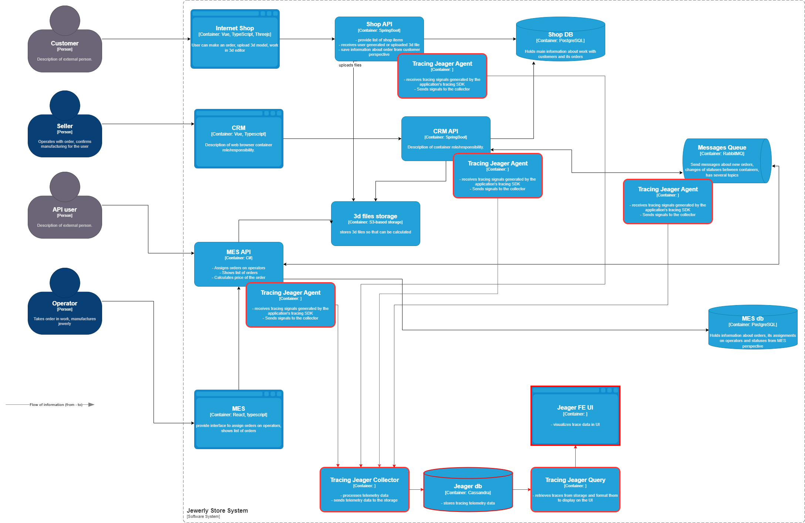

# 3. Трейсинг

## 2. Системы, которые нужно покрыть трейсингом

### Internet Shop API
- **Почему:** пользователь начинает оформление заказа здесь.
- **Где может зависнуть:**
  - При загрузке или генерации 3D-модели (`FILE_UPLOADED`).
  - При отправке заказа (`SUBMITTED`).
  - При получении стоимости (ожидание ответа от MES).

### MES API
- **Почему:** выполняет расчёт стоимости, контроль статусов и производство.
- **Где может зависнуть:**
  - Долгая обработка 3D-модели (30+ минут).
  - Ошибка в расчёте стоимости (`PRICE_CALCULATED` не приходит).
  - Зависание на статусе `MANUFACTURING_STARTED` — заказ никто не взял.
  - Задержка на `PACKAGING` или `SHIPPED`.

### CRM API
- **Почему:** принимает решение о запуске в производство.
- **Где может зависнуть:**
  - Заказ не доходит до статуса `MANUFACTURING_APPROVED`.
  - Проблемы с синхронизацией статусов из MES.
  - Ошибки при создании записи заказа из очереди (приём заказа по API).

### RabbitMQ (опосредованно, через лейблы в трейсах)
- **Почему:** соединяющее звено между системами.
- **Где может "сломаться":**
  - Потеря сообщения из-за ошибки маршрутизации.
  - Задержка в доставке или зависшее сообщение.
  
---

### Данные, которые должны попадать в трейсинг

### 1. Основные идентификаторы

- **trace_id** — глобальный уникальный идентификатор всей операции (запроса).
- **span_id** — уникальный идентификатор конкретного подзапроса или этапа.
- **parent_span_id** — идентификатор родительского спана (если есть), для построения дерева вызовов.

---

###  2. Статическая (resource) информация

Эти данные позволяют быстро фильтровать или группировать трассировки по окружению или сервису:

- `service_name` — имя сервиса (например, `shop-api`, `crm-api`, `mes-api`).
- `instance_id` — ID или имя инстанса, где запущен сервис.
- `node_name` — имя хоста или ноды в Kubernetes.
- `environment` — окружение (`dev`, `release`, `prod`).
- `deployment_version` — версия сервиса (git-коммит, номер сборки).

---

### 3. Динамический контекст операции

Позволяет анализировать конкретное поведение и проблемы в разных частях системы:

- `http_method` — метод запроса (GET, POST и т.д.).
- `http_path` — путь запроса (например, `/api/order/:id`).
- `http_status_code` — статус ответа (200, 500 и т.п.).
- `duration_ms` — длительность обработки запроса.
- `retry_count` — количество повторных попыток.
- `user_agent` — клиент, с которого пришёл запрос.
- `error_message` — сообщение об ошибке.
- `exception_type` — тип исключения.

---

### 4. Бизнес-контекст

Позволяет связать техническую трассировку с бизнес-событиями и анализировать поведение конкретных пользователей:

- `order_id` — уникальный идентификатор заказа.
- `user_id` — ID пользователя, создавшего заказ.
- `operator_id` — ID оператора, который обрабатывает заказ.
- `status_stage` — текущий этап заказа (например, `PRICE_CALCULATED`, `MANUFACTURING_STARTED`).
- `api_channel` — источник запроса (B2C, партнёр через API, оператор).

---

## 3. Мотивация

Внедрение распределённого трейсинга позволяет команде «Александрит» быстрее находить причины сбоев и задержек в системе. Вместо ручного анализа логов и раскрутки цепочки вызовов, разработчики получают визуальное представление о том, где именно «завис» запрос, сколько он длился и какие ошибки произошли.

С учётом того, что заказ может проходить через несколько микросервисов (shop, CRM, MES) и RabbitMQ, трейсинг даёт сквозную картину всего жизненного цикла заказа и помогает:
- Сократить время на диагностику проблем;
- Повысить надёжность за счёт раннего обнаружения «зависших» заказов;
- Упростить поддержку при росте количества заказов и нагрузки;
- Улучшить взаимодействие между командами (Dev, QA, DevOps);
- Сформировать данные для бизнес-аналитики по этапам заказов.

---

### Метрики, на которые влияет внедрение трейсинга

- **Среднее время обработки одного заказа** — поэтапная диагностика и оптимизация задержек.
- **Процент заказов, «застрявших» в промежуточных статусах** — ключевой показатель SLA.
- **Доля повторных ошибок по конкретным эндпоинтам** — помогает целенаправленно улучшать API.
- **Время на диагностику инцидента (MTTD/MTTR)** — снижается за счёт полной видимости запроса.
- **Процент обработанных сообщений в очереди RabbitMQ без повторов или потерь** — улучшение надежности интеграции.

---

## 4. Предлагаемое решение

Для внедрения распределённого трейсинга в системе «Александрит» предлагается использовать технологию **Jaeger**, как решение, совместимое с OpenTelemetry.

---

### Технологии и компоненты:

- **Jaeger Agent** — разворачивается рядом с каждым API-сервисом (Shop API, CRM API, MES API, RabbitMQ). Получает сигналы от SDK и отправляет их в коллектор.
- **Tracing SDK (OpenTelemetry)** — добавляется в каждый сервис. Формирует trace/span, передаёт их агенту.
- **Jaeger Collector** — агрегирует данные от агентов и передаёт в хранилище.
- **Jaeger DB** (Cassandra) — база для хранения trace-данных.
- **Jaeger Query + Jaeger UI** — предоставляет интерфейс для просмотра и анализа трассировок.

---

[Скачать обновлённую C4-диаграмму](jewerly_c4_model.drawio)

---

## 5. Компромиссы

### RabbitMQ

RabbitMQ — это технически открытая система, но трассировка через неё требует **ручной и нестандартной доработки**.  
В отличие от API-сервисов, RabbitMQ:

- Не создаёт свои собственные `span`-ы;
- Не поддерживает OpenTelemetry "из коробки";
- Требует ручного **извлечения trace_id из заголовков сообщений**;
- Требует **обёртывания публикации и потребления сообщений** в трейсинг на стороне приложений.

Кроме того, корректная трассировка сообщений между CRM и MES через RabbitMQ требует ручного внедрения SDK и соблюдения схемы контекстной передачи — это трудозатратно и подвержено ошибкам.

**Вывод:** реализация трейсинга в RabbitMQ **возможна**, но требует **доработок в коде всех сервисов, взаимодействующих с очередью**, и внимательной настройки агентов.

---

## 6. Аспекты безопасности

### Аутентификация и авторизация

- Доступ к UI (Jaeger UI) разрешён только сотрудникам компании.
- Используется **аутентификация через корпоративные учётные записи** (LDAP, SSO, OAuth2).
- Реализована **ролевой модель (RBAC)** — доступ разрешён только ролям, например:
  - `Support` — просмотр трассировок;
  - `DevOps` — настройка агентов и инфраструктуры;
  - `Developer` — просмотр и фильтрация по trace_id;
  - `ReadOnly` — аналитика без доступа к конфиденциальным данным.

---

### Санитизация и фильтрация данных

- Исключаются или маскируются потенциально чувствительные данные:
  - Персональные данные пользователей (PII);
  - `order_id`, `user_id`, `email`, `телефон`, `API keys`;
- Фильтрация происходит на уровне SDK и агентов:
  - только разрешённые атрибуты попадают в трассировку;
  - применяется список безопасных ключей и шаблонов.

---

### Шифрование и защита каналов

- Вся передача данных между компонентами трейсинга осуществляется по **TLS/SSL**:
  - между SDK и Jaeger Agent;
  - между Agent и Collector;
  - между Collector и БД;
  - между UI и пользователем (через HTTPS).
- Защита от перехвата данных, подмены и атак посредника (MITM).

---

### Срок хранения и удаление

- Ограничен срок хранения трейсинг-данных (например, 14–30 дней).
- Возможность удаления записей по запросу службы безопасности или в рамках GDPR ("право быть забытым").
- Архивация или автоудаление старых записей.

---

## 7. -