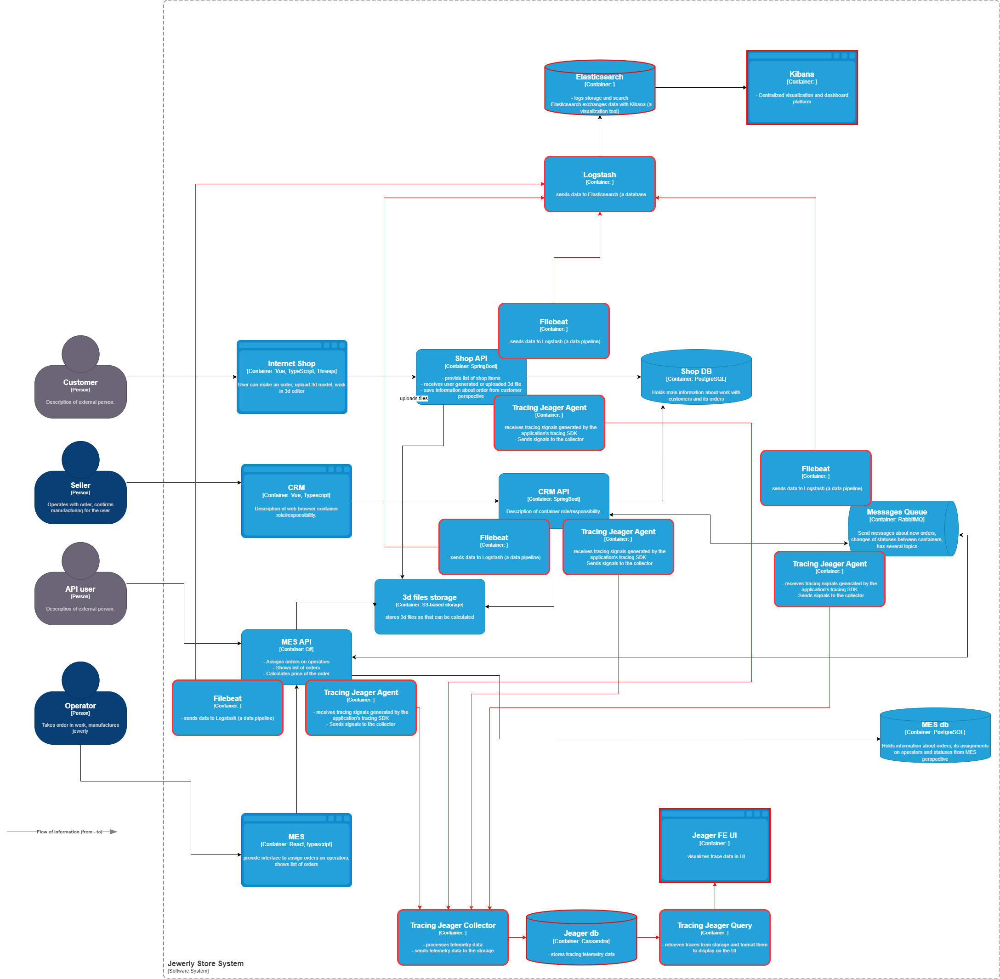

# 4. Логирование

## 2. Список необходимых логов

### Список логов (уровень INFO)

| Событие | Описание полей |
|--------|----------------|
| Изменение статуса заказа | `timestamp`, `order_id`, `user_id`, `old_status`, `new_status` |
| Загрузка 3D-модели | `timestamp`, `user_id`, `model_id`, `source` (upload/constructor) |
| Запуск расчёта стоимости | `timestamp`, `model_id`, `user_id`, `calculation_id` |
| Завершение расчёта стоимости | `timestamp`, `model_id`, `duration_ms`, `status`, `error_message (если есть)` |
| Авторизация пользователя | `timestamp`, `user_id`, `role`, `result (success/fail)` |
| Отправка заказа через API | `timestamp`, `user_id`, `order_id`, `channel (b2c/api/operator)` |
| Получение сообщения из RabbitMQ | `timestamp`, `queue`, `message_id`, `status (success/error)` |

---

### Примеры логов других уровней

- **ERROR**:  
  - Ошибка расчёта стоимости (`order_id`, `model_id`, `stack_trace`)  
  - Ошибка сохранения заказа в CRM (B2B-интеграция)

- **WARN**:  
  - Сообщение попало в DLQ RabbitMQ  
  - Заказ находится в статусе `SUBMITTED` более 20 минут  
  - Пользователь ввёл неправильный пароль более 5 раз подряд

- **FATAL**:  
  - Отказ подключения к базе данных  
  - Ошибка запуска приложения (например, отсутствие ENV-переменных)

---

### Компоненты, из которых собираются логи

- **Shop API**
- **CRM API**
- **MES API**
- **RabbitMQ**
- **DevOps-сервис CI/CD (для FATAL ошибок)**

---

## 3. Мотивация

Логирование необходимо для получения полной картины происходящего в системе. Оно помогает:

- быстрее выявлять и устранять ошибки;
- отслеживать жизненный цикл заказов и действий пользователей;
- собирать данные для технической и бизнес-аналитики;
- быть готовыми к анализу инцидентов и аудиту.

Мониторинг и логирование работают в связке: мониторинг сигнализирует о проблеме, а логирование помогает понять её природу. Вместе они формируют полноценную наблюдаемость.

---

### Метрики, на которые влияет внедрение логирования

- **MTTR (Mean Time to Recovery)** — время устранения инцидента сокращается за счёт быстрого анализа логов.
- **MTTD (Mean Time to Detect)** — сокращается время обнаружения ошибки, особенно при логировании ключевых точек.
- **SLA (Service Level Agreement)** — меньше сбоев, меньше времени простоя, выше удовлетворённость клиентов.
- **Процент необработанных заказов** — можно отследить через логи изменений статусов.
- **Процент ошибок расчёта стоимости** — по логам в MES можно анализировать стабильность логики расчёта.

---

### Приоритеты внедрения логирования и трейсинга

#### 1. RabbitMQ
- Точка интеграции между системами.
- Ошибки в очередях приводят к "потерянным" заказам.
- Необходим как для логирования доставки сообщений, так и для трейсинга сквозной цепочки.

#### 2. Расчёт стоимости 3D-моделей (MES)
- Долгий, ресурсоёмкий и критически важный этап.
- Зависания и сбои напрямую влияют на время выполнения заказа.

#### 3. Изменение статусов заказов (CRM / MES)
- Логирование жизненного цикла заказа — основа для SLA и анализа проблем.
- Позволяет быстро понять, где именно "завис" заказ.

#### 4. Shop API
- Начальная точка взаимодействия с пользователем.
- Важно логировать создание заказа, загрузку модели и отправку запроса.

#### 5. CRM API и MES API (в целом)
- Взаимодействие между системами.
- Логирование ошибок и бизнес-исключений.

---

Внедрение логирования в этих ключевых зонах позволит быстро получить отдачу даже при ограниченных ресурсах и постепенно расширить покрытие на все компоненты системы.

---

## 4. Предлагаемое решение

[Скачать обновлённую C4-диаграмму (с логированием)](./jewerly_c4_model.drawio)

### Технологии

- **Filebeat** — установлен на каждом сервисе, собирает логи приложений и пересылает в Logstash.
- **Logstash** — парсит, фильтрует, маскирует и обогащает логи метаданными (например, `service_name`, `environment`, `instance_id`).
- **Elasticsearch** — хранилище и поисковый движок для логов.
- **Kibana** — интерфейс визуализации, поиска и построения дашбордов.

---

### Компоненты, из которых собираются логи

- **Shop API**
- **CRM API**
- **MES API**
- **RabbitMQ (через Filebeat + system log)** 

---

## Политика безопасности логов

### Маскирование чувствительных данных

Для защиты персональных данных и внутренней информации реализуется автоматическая маскировка и фильтрация логов на этапе их обработки в Logstash:

- Маскируются или удаляются:
  - Email-адреса
  - Телефонные номера
  - Идентификаторы пользователей (`user_id`)
  - API-ключи и токены доступа (`Authorization`, `Bearer`)
  - Текстовые поля с потенциально конфиденциальной информацией

- Используется механизм `grok` и фильтры Logstash с регулярными выражениями (`mutate`, `anonymize`, `remove_field` и др.).

---

### Доступ к логам

- Логи хранятся в Elasticsearch с ограниченным доступом.
- Доступ имеют только:
  - **DevOps-инженеры** (настройка, технический анализ);
  - **Backend-разработчики** (для отладки, через Kibana);
  - **Администраторы безопасности** (аудит, расследования).
- **Менеджеры, тестировщики и бизнес-пользователи** не имеют доступа к логам по умолчанию.

---

### Аудит доступа

- Все действия с логами логируются (аудит):
  - кто заходил в Kibana;
  - какие фильтры использовал;
  - какие логи экспортировал или просматривал.

- При необходимости действия можно восстановить для анализа инцидента.

---

### Политика хранения

- Логи хранятся:
  - **30 дней** — для INFO и DEBUG;
  - **90 дней** — для WARN и ERROR;
  - **180+ дней** — для FATAL и инцидентных логов.
- Старая информация автоматически удаляется согласно политике ротации индексов Elasticsearch.

---

### Дополнительно

- Доступ к **Kibana** осуществляется только по **HTTPS** с аутентификацией.
- Внедрена ролевая модель (`ReadOnly`, `Dev`, `Admin`) с ограничением по namespace или полям логов.
- Отдельный индекс на каждую систему.
  
---

## 6. Превращение системы логирования в систему анализа логов

### Алертинг на основе логов

Настраиваются алерты по ключевым событиям и паттернам в логах:

- **FATAL-логи**: мгновенный алерт при появлении хотя бы одного сообщения уровня `FATAL`.
- **ERROR-логи**: алерт, если за 5 минут возникает более N сообщений `ERROR` в одном сервисе.
- **Ошибки расчёта 3D-моделей (MES)**: алерт при ошибке или слишком долгом расчёте.
- **Зависание статусов заказов**: если заказ "зависает" на одном статусе слишком долго (например, `SUBMITTED` > 60 мин).
- **Ошибки RabbitMQ**: сообщения не обрабатываются или попадают в DLQ.

---

### Аномалии и поведенческий анализ

Используются правила и механизмы поиска аномалий по логам:

- **Резкий всплеск активности**:
  - Например: обычно в минуту создаётся 10 заказов, но внезапно — 10 000.
  - Возможные причины: DDoS, массовая ошибка, бот-атака.
- **Аномальный рост логов об одной операции**:
  - Повторяющиеся попытки оплатить заказ;
  - Бесконечные повторные запросы к API;
  - "шум" от неудачных авторизаций.

Для этого можно использовать:
- **Kibana Alerting**;
- **ML-модули**;
- **визуальные аномалии на графиках логов и частоты событий**.

---

### Метрики из логов

- Среднее время расчёта модели;
- Количество заказов по статусам;
- Количество ошибок на каждый endpoint;
- География IP-адресов при авторизации.

---

## 7. Критерии выбора технологии для работы с логами

Ниже приведены основные критерии, по которым выбиралась технология для централизованного логирования в системе «Александрит». Сравнение выполнено между четырьмя популярными решениями: **ELK (Elasticsearch + Logstash + Kibana)**, **OpenSearch**, **Splunk** и **Grafana Loki**.

| Критерий                            | ELK                                   | OpenSearch                           | Splunk                         | Grafana Loki                    |
|------------------------------------|----------------------------------------|--------------------------------------|-------------------------------|---------------------------------|
| **Лицензия**                       | Elastic License (ограничена)          | Apache License 2.0 (открытая)        | Проприетарная                 | MPL 2.0 (открытая)              |
| **Гибкость настройки парсинга**    | Очень высокая (Logstash, grok, mutate)| Высокая (совместим с Logstash)       | Очень высокая                 | Средняя (логика простая)        |
| **Скорость поиска**                | Высокая, особенно при оптимизации     | Высокая, сопоставима с ELK           | Очень высокая                 | Средняя (ориентирована на поток)|
| **Простота масштабирования**       | Умеренная, требует настройки          | Упрощена по сравнению с ELK          | Сложная и дорогая             | Лёгкая и горизонтально масштабируемая |
| **Стоимость владения (TCO)**       | Умеренная (опенсорс + ресурсы)        | Низкая (бесплатно, Apache)           | Высокая (по подписке)         | Очень низкая (легковесный стек)|
| **Наличие визуализации**           | Kibana (богатый UI)                   | OpenSearch Dashboards                | Собственный UI                | Интеграция с Grafana            |
| **Сообщество и поддержка**         | Большое, но частично закрытое         | Активное опенсорс-сообщество         | Коммерческая поддержка        | Активное (часть Grafana Labs)   |

---

### Обоснование выбора: ELK

На текущем этапе для системы «Александрит» выбран стек **ELK (Elasticsearch + Logstash + Kibana)**, так как он:

- ✅ Предоставляет **максимальную гибкость парсинга и фильтрации логов**;
- ✅ Поддерживает **маскирование, трансформацию и обогащение данных** (через Logstash);
- ✅ Имеет **удобную и зрелую визуализацию в Kibana**;
- ✅ Подходит для **сбора логов с разных источников** (файлы, stdout, брокеры, базы);
- ⚠️ Требует настройки и ресурсов, но **не влечёт лицензионных затрат**, если используется self-hosted.

---
