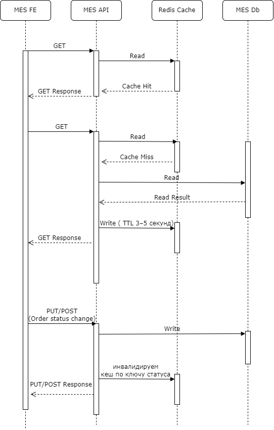

# 5. Архитектурное решение по кешированию

## 3. Мотивация

Внедрение кеширования в систему «Александрит» необходимо для снижения нагрузки на наиболее чувствительные компоненты и повышения производительности, особенно при увеличении объёма заказов и обращений через API.

---

### Какие проблемы решает кеширование

1. **Долгая загрузка дашборда в MES**  
   - При открытии первой страницы MES система медленно загружает заказы со всеми статусами.  
   - Даже с пагинацией и фильтрацией страница долго рендерится.  
   - Кеширование свежих заказов по статусам и временным меткам позволит ускорить отображение информации для операторов.

2. **Повторные расчёты стоимости 3D-моделей**  
   - MES пересчитывает стоимость при каждом обращении, причём расчёт может занимать до 30 минут.  
   - Кеширование результатов расчёта на основании хэша 3D-модели позволит повторно использовать уже посчитанные значения, сократив нагрузку и ускорив ответы.

3. **Повторные запросы от API-партнёров**  
   - При высокой частоте обращений от партнёров повторяются одинаковые запросы на одни и те же заказы и расчёты.  
   - Использование кеша на уровне API позволит отдавать данные быстрее и снизит избыточную нагрузку на CRM и MES.

---

### Что планируется включить в кеширование

| Компонент              | Что кешируем                       | Срок хранения / инвалидация |
|------------------------|------------------------------------|------------------------------|
| **MES API**            | Стоимость 3D-моделей               | 24 часа или при изменении   |
| **MES дашборд**        | Список свежих заказов по статусам  | 1–5 минут                   |
| **CRM API**            | Повторные запросы партнёров        | 5–10 минут                  |

---

### Ожидаемый эффект

- Повышение скорости отклика MES и CRM.
- Снижение времени загрузки интерфейсов.
- Снижение нагрузки на базу данных и процесс расчёта.
- Улучшение пользовательского опыта и увеличение удовлетворённости операторов и клиентов.

---

## 4. Предлагаемое решение

В системе «Александрит» предлагается использовать **серверное кеширование** для ключевых компонентов, где наблюдаются задержки или повторные обращения к одним и тем же данным. 

---

### Серверное кеширование

#### MES API (расчёт стоимости 3D-моделей)
- **Тип:** серверное
- **Паттерн:** `Write-Behind`
- **Почему:** расчёт может занимать до 30 минут. Запись результатов в БД происходит асинхронно — пользователь получает ответ быстрее, т.к. данные сохраняются сразу в кеш. Это снижает задержку и повышает масштабируемость.

- Высокая производительность и отзывчивость  
- Компоненты работают независимо  
- Подходит для микросервисной архитектуры  
- Требует надёжной фоновой обработки (например, очередь, таск-планнер)

---

#### CRM API (повторные запросы B2B)
- **Тип:** серверное
- **Паттерн:** `Cache-Aside`
- **Почему:** данные часто читаются повторно, но могут меняться не в самой CRM. Приложение само контролирует, когда читать и обновлять кеш. Удобно реализовать TTL и управлять консистентностью.

- Простая реализация  
- Гибкость TTL  
- Возможна неконсистентность, если запись произошла вне кеша

---

#### MES Dashboard (загрузка заказов)
- **Тип:** серверное
- **Паттерн:** `Cache-Aside` с коротким TTL (3–5 секунд)
- **Почему:** данные меняются быстро, и важно показывать актуальные статусы. Вместо клиентского кеша, который может устаревать, используется серверный кеш с автоинвалидацией. Приложение проверяет кеш, если его нет или он истёк — делает запрос к базе и обновляет кеш.

- Контроль над актуальностью  
- Ускорение при высокой нагрузке  
- Необходима надёжная очистка кеша и ограниченный TTL

---

### Сводная таблица

| Компонент        | Тип кеша     | Паттерн           | Особенности                         |
|------------------|--------------|-------------------|--------------------------------------|
| MES API  | Серверный    | Write-Behind      | Высокая производительность, асинхронность |
| CRM API          | Серверный    | Cache-Aside       | Гибкое TTL, ручное управление        |
| MES Dashboard    | Серверный    | Cache-Aside       | Краткоживущий кеш (3–5 сек), высокая актуальность |

---

## 5. Диаграмма последовательности: чтение и обновление заказов + кеширование

- **MES FE** — пользовательский интерфейс оператора;
- **MES API** — серверная логика и обработка запросов;
- **Redis Cache** — слой кеша для ускорения операций чтения;
- **MES Db** — основная база данных заказов.

---

### Чтение списка заказов

При получении заказов по статусу используется паттерн `Cache-Aside` с коротким TTL (3–5 секунд):

1. MES FE отправляет `GET /orders?status=SUBMITTED`.
2. MES API проверяет наличие данных в `Redis Cache`.
3. Если данные есть (Cache Hit) — отдаёт результат из кеша.
4. Если данных нет (Cache Miss) — читает из `MES Db`, сохраняет в кеш и отдаёт клиенту.
5. Сохраняется результат в Redis с TTL 3–5 секунд.

---

### Обновление статуса заказа

При изменении статуса заказа, например, `MANUFACTURING_STARTED`, происходят следующие шаги:

1. MES FE отправляет `PUT /order/:id` с новым статусом.
2. MES API обновляет статус в базе (`MES Db`).
3. MES API инвалидирует кеш по ключу соответствующего статуса (например, `orders:SUBMITTED`).
4. Возвращает результат клиенту.

---

### Участвующие бизнес-сущности

В процессе участвуют следующие ключевые атрибуты:

- `order_id` — уникальный идентификатор заказа;
- `status_stage` — текущий статус заказа;
- `operator_id` — идентификатор пользователя, инициировавшего обновление;
- `timestamp` — момент запроса / обновления;
- `cache_key` — ключ кеша (например, `orders:SUBMITTED`).

---

### Диаграмма

Диаграмма демонстрирует оба сценария — чтение (с `hit` и `miss`) и обновление статуса — в рамках паттерна `Cache-Aside`.

---

## 6. Стратегия инвалидации кеша

Для системы «Александрит» предлагается двухэтапный подход к инвалидации кеша. Такой подход позволяет быстро запустить базовое кеширование, а в будущем перейти к более точной и реактивной логике.

---

### Этап 1: Временная инвалидация (TTL)

**Описание:**  
Каждый ключ в кеше живёт строго ограниченное время (например, 3–5 секунд). После истечения срока данные автоматически удаляются и при следующем запросе будут обновлены из базы данных.

**Плюсы:**
- Простая реализация
- Не требует изменения логики приложения
- Хорошо работает для часто обновляемых данных, когда точность важна, но допустима задержка в пару секунд

**Почему выбрано:**  
Этот подход позволяет **быстро снизить нагрузку на базу данных** и ускорить время отклика API, при этом **не внося сложных изменений в архитектуру**. Он идеально подходит для начального этапа внедрения кеша в условиях высокой нагрузки и ограниченных ресурсов команды.

---

### Этап 2: Инвалидация на основе изменений

**Описание:**  
Кеш инвалидации происходит в момент изменения данных — например, когда заказ переходит в новый статус. Приложение или сервис, изменяющий данные, инициирует удаление соответствующего ключа из кеша.

**Плюсы:**
- Обеспечивает высокую актуальность данных
- Нет необходимости в ожидании окончания TTL
- Подходит для бизнес-критичных сценариев (например, MES Dashboard)

**Почему выбран в перспективе:**  
После стабилизации архитектуры и внедрения базового кеша можно перейти к **более точной и “умной” стратегии**, которая будет реагировать на реальные изменения данных в системе (например, смена статуса заказа). Это обеспечит **минимальные задержки** и **максимальную согласованность** информации.

---

### Сравнительная таблица стратегий

| Стратегия                         | Подходит сейчас? | Преимущества                                           | Ограничения / Почему не основная |
|----------------------------------|------------------|--------------------------------------------------------|-----------------------------------|
| Временная инвалидация (TTL)    | Да             | Простота, скорость внедрения, стабильность            | Возможна устаревшая информация до 3–5 секунд |
| Инвалидация на основе изменений | Позже         | Реактивность, актуальность, бизнес-контроль           | Требует программной логики и событийной модели |
| Программная инвалидация        | Нет            | Максимальная гибкость                                 | Сложна для начального внедрения |
| Инвалидация на запросах        | Нет            | Умная подстройка под активность                       | Непредсказуемое поведение и сложная реализация |
| Инвалидация по ключу           | Частично       | Используется в дополнение, но не как основная стратегия | Требует строгой дисциплины в управлении ключами |

---

### Вывод

> В рамках первого этапа внедрения кеширования используется **временная инвалидация (TTL)**.  
> В перспективе предусмотрен переход на **инвалидацию по событиям/изменениям**, что обеспечит более высокую точность и контроль.

## 7. -
